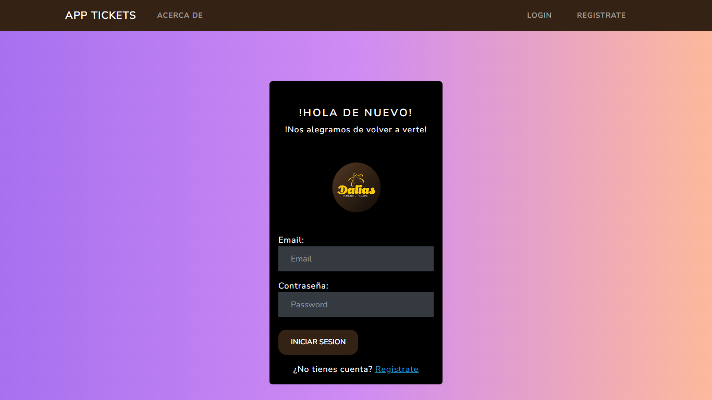

NOTES APP FOR DALIAS

Project application for the company "Dalias Pasteleria & Panaderia" using Javascript technologies such as Nodejs, Mongodb and other related techniques. This is an application created for the existing problem within the real business and its solution through this study. It uses Handlebars as a template mechanism.

This app can do:

CRUD Operations: create/read/update/delete Notes Allows a user to do login and save his personal notes

cd nodejs-notes-app npm i npm run dev # run in development mode npm start # run in production mode
Señor ayudame.
Actualizacion readme. 